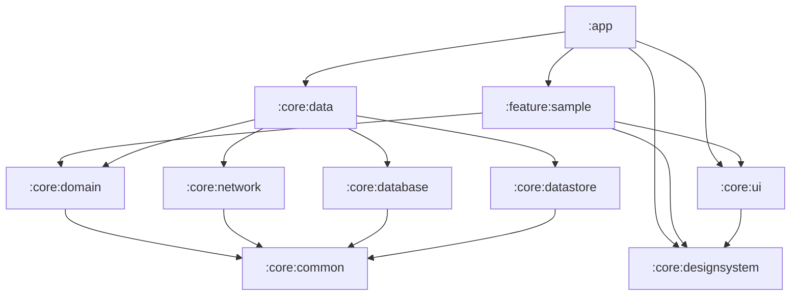

# Architecture Overview

Beader follows **Clean Architecture** with a **Unidirectional Data Flow**
(MVVM) presentation layer, split across Gradle modules so the dependency
graph enforces the architecture rather than relying on convention alone.

## Layers

```
┌─────────────────────────────────────────────────────────┐
│                         :app                             │
│   Application, NavHost, DI graph roots. Wires features   │
│   together; contains no business logic of its own.       │
└───────────────────────────┬───────────────────────────────┘
                             │ depends on
                             ▼
┌─────────────────────────────────────────────────────────┐
│                    :feature:*                            │
│   One module per user-facing feature. Owns its           │
│   ViewModel, UiState, Composable screens, and nav graph.  │
│   Presentation layer — talks to the domain layer only     │
│   through use cases.                                      │
└───────────────────────────┬───────────────────────────────┘
                             │ depends on
                             ▼
┌─────────────────────────────────────────────────────────┐
│                    :core:domain                          │
│   Pure Kotlin/JVM, zero Android dependencies. Use cases,  │
│   domain models, repository interfaces. This is the       │
│   business-rule layer and the most stable part of the     │
│   codebase — it should rarely change for UI or            │
│   infrastructure reasons.                                 │
└───────────────────────────▲───────────────────────────────┘
                             │ implements
┌───────────────────────────┴───────────────────────────────┐
│                    :core:data                             │
│   Implements domain repository interfaces. Coordinates    │
│   :core:network, :core:database, :core:datastore, and     │
│   decides caching / offline-first policy. Maps DTOs and   │
│   entities to domain models at this boundary — nothing    │
│   above this layer ever sees a DTO or a Room entity.       │
└─────────────────────────────────────────────────────────┘
```

Supporting modules used across the layers above:

| Module               | Contains                                          | Depends on |
|-----------------------|----------------------------------------------------|------------|
| `:core:common`         | `DataResult`, dispatcher qualifiers, small shared utilities. Pure Kotlin/JVM. | — |
| `:core:network`        | Retrofit/OkHttp setup, API services, DTOs.        | `:core:common` |
| `:core:database`       | Room database, DAOs, entities.                    | `:core:common` |
| `:core:datastore`      | Preferences DataStore wrappers.                   | `:core:common` |
| `:core:designsystem`   | `MaterialTheme`, color/type tokens, primitive components (`BeaderButton`, etc). No business concepts. | — |
| `:core:ui`             | Composite, reusable composables built on `:core:designsystem` (`FullScreenLoading`, `FullScreenError`). Shared *across* features. | `:core:designsystem` |
| `:core:testing`        | Test doubles (`FakeSampleRepository`), `MainDispatcherRule`, `HiltTestRunner`. `testImplementation`/`androidTestImplementation` only. | `:core:common`, `:core:domain` |

## Dependency direction rules

1. **Downward only.** `:app` → `:feature:*` → `:core:domain` ← `:core:data` → (`:core:network`, `:core:database`, `:core:datastore`). Nothing points back up.
2. **Feature isolation.** `:feature:*` modules never depend on each other. Cross-feature navigation happens through `:app`'s `NavHost`, which composes each feature's `NavGraphBuilder` extension (e.g. `sampleScreen()`).
3. **`:core:domain` has no Android dependency.** It is a `org.jetbrains.kotlin.jvm` module, not `com.android.library`. If you find yourself importing `android.*` there, the code belongs in `:core:data` or a feature module instead.
4. **DTOs and entities never leave `:core:data`.** `SampleItemDto` (network) and `SampleItemEntity` (database) are mapped to `SampleItem` (domain) inside the repository implementation. ViewModels and Composables only ever see domain models.
5. **`:core:designsystem` vs `:core:ui`.** Design tokens and primitive, style-only components (buttons, colors, typography) live in `designsystem`. Composite, stateless UI patterns that combine several primitives and encode a UX decision (a full-screen loading/error state) live in `ui`. When in doubt: if it renders business or domain data, it doesn't belong in either — it belongs in the feature module.

## Data flow example: `feature:sample`

```
SampleScreen (Composable)
   ▲ observes StateFlow<SampleUiState>
SampleViewModel
   │ calls
GetSampleItemsUseCase / ToggleFavoriteUseCase   (:core:domain)
   │ calls interface
SampleRepository                                (:core:domain, interface only)
   ▲ implements
SampleRepositoryImpl                            (:core:data)
   │ Room is the source of truth; network refresh writes into Room,
   │ UI always reads from the DAO's Flow.
   ├── SampleApiService   (:core:network)
   └── SampleItemDao      (:core:database)
```

## Module dependency graph



## Why this split

- **Build performance.** Gradle parallelizes and caches per-module; changing `:feature:sample` doesn't recompile `:core:network`.
- **Enforced boundaries.** A module cannot accidentally depend on something it shouldn't — the dependency doesn't compile rather than relying on code review to catch a layering violation.
- **Testability.** `:core:domain` and `:core:common` are pure JVM, so their tests run without an emulator or Robolectric.
- **Parallel ownership.** Separate features can be owned by separate people/teams without stepping on each other's modules.
